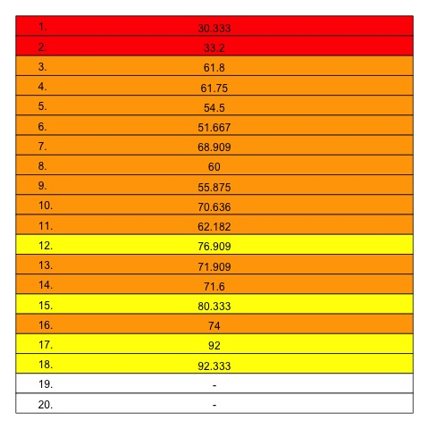

# Track Position vs. Chart Peak

An investigation into the statistical correlation between a track's position on an album and its peak chart position on the Billboard Hot 100. Leverages the Spotify Web API.

  
  

### Acknowledgments

- __Data retrieved from__ [Spotify](https://developer.spotify.com/documentation/web-api/reference/#/) and [Billboard](https://www.billboard.com/artist/taylor-swift/chart-history/hsi/)