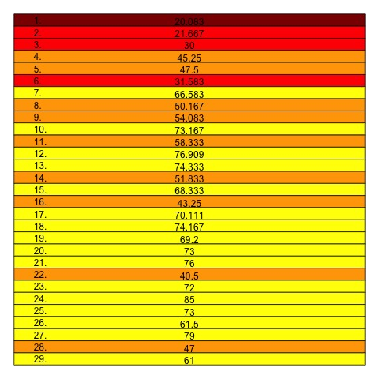

## Abstract

This analysis investigated the correlation between a track's position on an album and its peak chart position on the Billboard Hot 100. Some of the conclusions

- Up to 83.36% of the variation in average peak position for a track can be explained by its position in an album
  - Up to 96.06% can be explained when ranking tracks for each album
- There is an obvious general trend across albums where tracks closer to the top of an album chart higher

## Data

[The data for this analysis](./data/all-tracks.csv) includes track that appears in an album, following the schema:

| Key            | Type   | Description                                                          |
| -------------- | ------ | -------------------------------------------------------------------- |
| `id`           | string | Spotify id for the track                                             |
| `name`         | string | Song title                                                           |
| `peak`         | number | Peak position on chart                                               |
| `album`        | string | Name of album                                                        |
| `albumIndex`   | number | Chronological index of album                                         |
| `isAltVersion` | bool   | True for alternate versions (instrumental, mix, longer version, etc) |
| `isSingle`     | bool   | True for tracks released as singles                                  |
| `isBonus`      | bool   | True for bonus tracks                                                |
| `isVault`      | bool   | True for vault tracks from re-recorded albums                        |
| `isTV`         | bool   | True for all tracks on re-recorded albums                            |

For the analyses, all alternate versions were omitted. An additional column, `album_pos` was added, representing the track's index in the album.

## Heat Map Analysis

By generating heat maps for the tracks, there is an observable pattern where tracks that are listed earlier in an album tend to chart higher:

  
  

_The heatmaps for all 224 tracks (left) and for folklore tracks (right)_

## Linear Regression

A total of 64 models were compared, modelling `mean(peak) ~ album_pos`. The models varied by:

- Adjusting the value `peak` for tracks that never charted
- Setting a cutoff for number of tracks taken from each album
- Including or exluding singles and bonus tracks

By comparing the models using the coefficient of determination $R^2$, the best model was chosen. This model adjusted uncharted peak positions to 101, took the first 20 tracks from each album, and excluded both singles and bonus tracks.

The formula for the model was $y = 2.9715x + 37.3965$, with $R^2 = 0.8336$

### Ranked

The same process for chosing the best model was repeated, but ranking each track according to its relative peak position. For example, in an album where the highest peak positions were 2 and 4, they would be assigned ranks of 1 and 2, respectively.

The chosen best model used the same parameters. 

The formula for the model was $y = 0.93799x + 3.3727$, with $R^2 = 0.9606$
